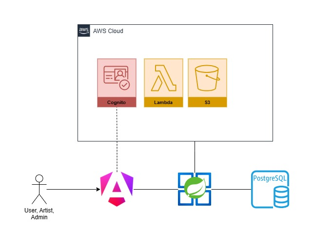

# SPRING TUNES API

**Spring Tunes** es un clon simplificado de Spotify, desarrollado como proyecto de portafolio backend con **Spring Boot + Angular**. Permite a los usuarios explorar, escuchar y organizar música, mientras integra un sistema de aprobación para artistas y contenido.

### 🛠 Tecnologías principales:

- **Backend**: Java + Spring Boot
- **Frontend**: Angular
- **Base de datos**: PostgreSQL
- **AWS**: 
  - Cognito: Autenticación de usuarios.
  - S3: Almacenamiento de archivos.
  - Lambda: Funciones de backend como correos.

### 🔑 Funcionalidades clave:

- Autenticación segura mediante Cognito.
- Solicitud y aprobación de perfiles de artista.
- Subida y revisión de canciones antes de su publicación.
- Reproducción de audio vía streaming.
- Creación de playlists, favoritos y sistema de roles (`USER`, `ARTIST`, `ADMIN`).

### 🚧 Arquitectura:

## 📝 Variables de entorno
| Variable        | Descripción                                                               | Valor por defecto |
| --------------- | ------------------------------------------------------------------------- | ---------------- |
| `DB_HOST`       | Dirección del host de la base de datos PostgreSQL.                        | `localhost`      |
| `DB_PORT`       | Puerto en el que PostgreSQL está escuchando.                              | `5432`           |
| `DB_NAME`       | Nombre de la base de datos a la que se conectará la aplicación.           | *(requerido)*    |
| `DB_USER`       | Usuario con permisos para acceder a la base de datos.                     | *(requerido)*    |
| `DB_PASSWD`     | Contraseña correspondiente al usuario de la base de datos.                | *(requerido)*    |

## 📦 Base de datos
El proyecto no crea el esquema automáticamente (spring.jpa.hibernate.ddl-auto=validate). Asegúrate de tener las tablas creadas con el script SQL incluido antes de ejecutar la aplicación.
Debes asociar un ID usuario de Cognito a un usuario de la base de datos.